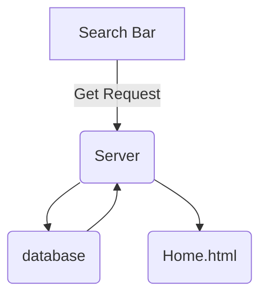

# Tagging and Searching
Searching in a forum is a common task that allows users to find relevant information based on post title, post Content and Tags .
To effectively search in a forum, we can follow these steps:

## Extra tables required for tagging
Tags and Posts are many to many relationship. So we need a table to store the relationship between them. We can call it PostTags. It will have two columns, PostId and TagId. Both of them will be foreign keys to Posts and Tags table respectively.
1. Tags
2. PostTags

## Using the Search Bar:

Once you've located the search function, follow these guidelines for using the search bar effectively:

1. Plaintext Search: Type keywords related to the topic or information you're looking for. Be specific but avoid using overly long or complex phrases.
2. Username Search: In the search bar, type "@" followed by the username you want to search for, without any spaces. For example, if you want to search for posts or comments by a user with the username "JohnDoe," you would type "@JohnDoe" in the search bar.
3. Hashtag Search: In the search bar, type "#" followed by the tag you want to search for, without any spaces. For example, if you want to search for discussions tagged with "technology," you would type "#technology" in the search bar.

## Reviewing Search Results:
After submitting your query, the forum will display a list of search results, including posts and comments that match your search criteria.

## searching flowchart

## Team
J. Chaitanya
K. Akhila